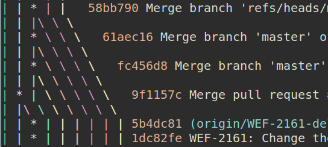
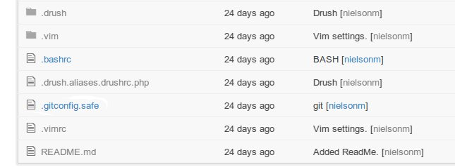

!SLIDE
# Git It On
Git is the latest and most exciting piece of SCM in a long time, even better it's 100% open source.  Git is now the main source control on drupal.org. Easy to install and super flexible, source control isn't just for the corporate types anymore.    This introductory session highlights how to use Git not only as a source control client in a team setting, but how to manage just about any kind of electronic information.

   Providing the unique perspectives of a serial team developer and a freelance designer, this session will cover topics like:

!SLIDE
## About us
Mike Nielson - Developer at 

   

!SLIDE
## About us

Marlene Williams

   

!SLIDE
.notes CAVEAT - I'm going to use code as a generic placeholder for anything textual that could be revised. EVER.
## Why git is so special?

  git remembers your past.

  It remembers everything, including passwords

  `git reset` → `git commit --amend` → change pwd - you're hosed.

  Everything's in patches, can be emailed.

  Git can be used offline, like on the train, or on a 17+ hour flight to Sydney, nudge nudge ;).

!SLIDE
.notes git was written for the linux kernal dev, a geographically diverse, temporally dislocated, cranky bunch with extreme organizational challenges & a Napeoleonic complex.
## Besides D.O. who else is using Git?  (Hint: the answer may surprise you)
  Linux Kernal, Ruby, Gnome, Microsoft, Netflix, Android, Facebook, Google, Perl, PostgreSQL, Rails, Gnome, KDE, X.org, and more.

!SLIDE
## Government
  We the People is a petition webapp that allows authenticated users to submit petitions directly to the Whitehouse.

  NASA has a GH acct.

[https://github.com/nasa](https://github.com/nasa)

!SLIDE
.notes Laws are the operating system of society, the scope of the project is enormous and the clients expectations can be a nightmare.
## Government - cont.

  German legislature releases their draft legislation on GH, this is HUGE.

  Github's repos can be made public, so now ppl can view ammendments to pending legislation.

  Not only are the laws on GH, but tools to implement this locally. [https://github.com/bundestag/gesetze-tools](https://github.com/bundestag/gesetze-tools)

!SLIDE
## Education

Bill Fitzgerald from Portland's own Funny Monkey suggested that git could be used by teachers to build, share and maintain curricula. Info graphic included: [https://s3.amazonaws.com/easel.ly/all_easels/33386/Teacher_Git/image.jpg](https://s3.amazonaws.com/easel.ly/all_easels/33386/Teacher_Git/image.jpg)   [http://funnymonkey.com/thinking-about-the-verbs](http://funnymonkey.com/thinking-about-the-verbs)

.notes Mike's last slide, Marlene's turn.

!SLIDE
## Setting up Git
###Installing on all the popular OSs###

GitHub help [https://help.github.com](https://help.github.com)

###Config###

**user.name:** `git config --global user.name "YOUR NAME"`

**user.email:** `git config --global user.email email@email.com`

**color.ui:** `git config --global color.ui true`

[https://help.github.com/articles/set-up-git#platform-all](https://help.github.com/articles/set-up-git#platform-all)

!SLIDE
## Creating your repo + basic commands
`git status`

`git init`

`git add [path-to-file]`

`git rm [path-to-file]` (`--cached` for removing only from the repo)

`git commit -m "Your commit message here."`

`git log --stat`

!SLIDE
## Sharing with others

You have many ways to share your code using git, including quite a few Git-specific hosting providers such as Bitbucket, Githost, GitHub, and Unfuddle.

### GitHub
Again GitHub help helps! [help.github.com](help.github.com)

Create a repo on GitHub

Connect the local repo to GitHub (follow GitHub's instructions!)

Push to GitHub + pull from GitHub

Github has an application for Macs, too...

!SLIDE
.notes Marlene's last slide, Mike's turn.

## Treasure hunting

Others share their code, too, and some of it is really cool!

* JS libraries
* Frameworks
* Sublime packages
* CSS/SASS/LESS snippets
* Demos
* Presentations

`git clone [url of repo]`

Then `git pull` lets you easily pull in any updates to the code.

!SLIDE
.notes What if DEV X's code was crap - cherry picking the best commits is trivial.
.notes Branching branches, why not?  But that goes into the weeds.
## Branching and merging to maximize efficiency on a project
Encourages a branching style of concurrent development
Why concurrent - more stable - bandwidth

BASE - Mike - views - features - custom fields

  \                                            \ Merge

   Marlene - theme - views tpls (pay attention)   - merge branches - resolve merge conflict - deploy and happy day

GH also has this neat concept called pull request, which is basically you asking for a branch merge.

!SLIDE
## Identifying the suck.

Git bisect makes finding the bug, post commit, easier.
  Binary search, start with good and bad, find bad
  

Git blame - "For instance, Git can instantly tell you where does THIS LINE come from, even if this line moved across different files over years."

!SLIDE
## How to use git to do other neat things besides manage your project code
  Use it to manage your configuration files, your memoires, that novel you've been kicking around in your head, heck even a blog (GH pages).

!SLIDE
## How to contribute back to the community by using git

This could be a presentation in & of itself. But the best way to get involved using git is to use git to submit patches on D.O.  For the uninitiated, here's the cliff notes version.

  Step 1: Discover bug.

  Step 2: Find fix.

  Step 3: Clone project.
  [http://drupal.org/project/zen/git-instructions](http://drupal.org/project/zen/git-instructions)

  Step 4: Make fix on git clone.

!SLIDE
## How to contribute back to the community by using git - cont.
  Step 5: Make a patch.

  Step 6: Submit patch to relevant issue or create one.

  Step 7: Glory in the victory.

  ...

  Step 8: Profit!

[http://drupal.org/documentation/git](http://drupal.org/documentation/git)

[http://drupal.org/node/707484](http://drupal.org/node/707484)

!SLIDE
## Tricky tips and tricks
  Git aliases

  You'll probably type `git status` 50 times a day for the duration of your use with git, so use an alias.

  `git checkout -p` →  `git chp`

  `git diff --staged` → `git ds`

!SLIDE
## Tricky tips and tricks - cont.

  `git lg` = `git log --all --graph --pretty=format:'%Cred%h%Creset -%C(yellow)%d%Creset %s %Cgreen(%ci) %C(bold blue)<%an>%Creset' --abbrev-commit`

Let's add `-p`!!

!SLIDE
.notes Your .gitconfig is in your home directory, more than likely.
## Tricky tips and tricks - cont.

  All the sortcuts you've seen me use today are on GH.
[https://github.com/nielsonm/dotfiles/blob/master/.gitconfig.safe](http://github.com/nielsonm/dotfiles/blob/master/.gitconfig.safe)

!SLIDE
## To sum it all up.
  Why GIT?
  How to get things started.
  Sharing code.

!SLIDE

Questions?

Thanks a million!1!

@oswebguy @mindewen

